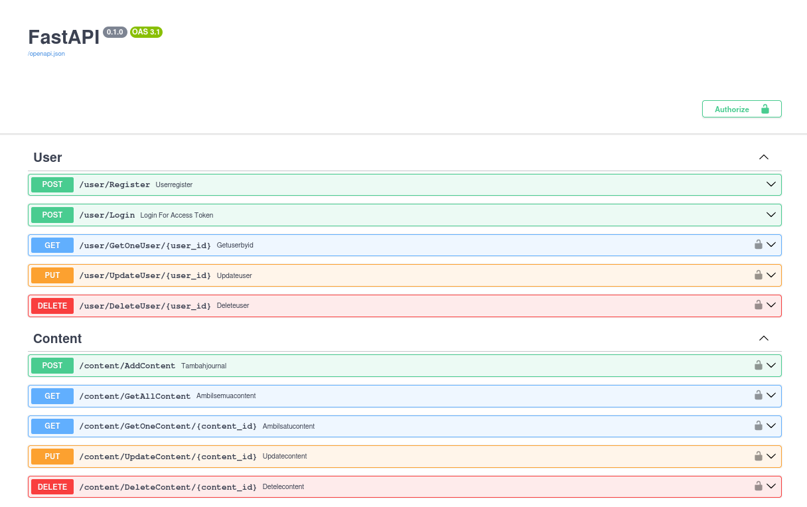
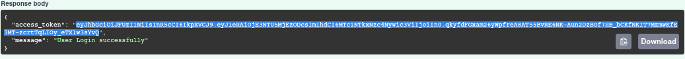
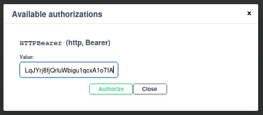
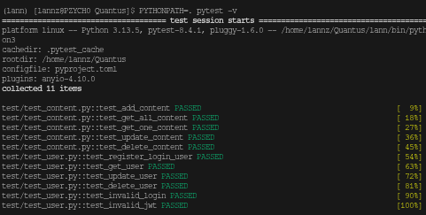
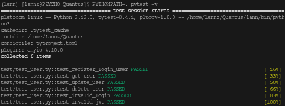

<!-- Warning :: Using CTRL + SHIFT + V For View README.md In Visual Studio Code :: Warning-->
<h1 align="center">Backend Journal Application With FastAPI Framework</Strong></h1>

 

 

<h2><Strong> Tech-Stack : </Strong></h2>
<ul>
    <li>FastAPI-Python</li>
    <li>PostgreSQL (DATABASES)</li>
    <li>SQLModel (ORM)</li>
    <li>Argon2 (Password Hashing)</li>
    <li>PyJWT + ES256 Algorythm</li>
    <li>Alembic Migration</li>
    <li>Uvicorn ASGI Server</li>
</ul>

 

<h2><Strong> Endpoints : </Strong></h2>
<h4> User Endpoints : </h4>
<ul>
    <li>/user/Register</li>
    <Strong> => This Endpoint For Register User Only, ADMIN Cannot Register</Strong>
    <li>/user/Login</li>
    <Strong> => This Endpoint For Get Jwt Tokens, For Access Some Features</Strong>
    <li>/user/GetOneUser/{user_id}</li>
    <Strong> => This Endpoint For Get One User By ID, Only ADMIN Can Access This Endpoints</Strong>
    <li>/user/UpdateUser/{user_id}</li>
    <Strong> => This Endpoint For Update One User By ID, All User Can Access This Endpoints</Strong>
    <li>/user/DeleteUser/{user_id}</li>
    <Strong> => This Endpoint For Delete One User By ID, All User Can Access This Endpoints</Strong>
</ul>

<h4> Content Endpoints : </h4>
<ul>
    <li>/content/AddContent</li>
    <Strong> => This Endpoint For Add New Journal , User or ADMIN Can Post The Title , Category , Status , Content , And Cover Images The Journal</Strong>
    <li>/content/GetAllContent</li>
    <Strong> => This Endpoint For Get All Journal With The Pagination</Strong>
    <li>/content/GetOneContent/{content_id}</li>
    <Strong> => This Endpoint For Get One Journal By ID</Strong>
    <li>/content/UpdateContent/{content_id}</li>
    <Strong> => This Endpoint For Update One Journal By ID</Strong>
    <li>/content/DeleteContent/{content_id}</li>
    <Strong> => This Endpoint For Delete One Journal By ID</Strong>
</ul>

 

<h2><Strong> Features : </Strong></h2>
<ul>
    <li>Security And Authentication</li>
    <Strong> => Using Argon2 For Hashing Password (standard Password Hashing), JWT Token With Signature ES256 Algorythm (The Best Curve Ellipsis) </Strong>
    <li>Data Security</li>
    <Strong> => Using SQLModel ORM For Secure Data From SQLInjection Attack And=uuid4 For Create Unique ID</Strong>
    <li>Easy To Build</li>
    <Strong> => Using Alembic Migration And pyproject.toml , Easy to build</Strong>
</ul>

 

<h2><Strong> How To Build :</Strong></h2>
<ol>
    <li>Clone Git Repository (git clone https://github.com/fadlannn69/Quantus.git)</li>
    <li>Install Python3 , PostgreSQL ,and DBeaver(Optional)</li>
    <li>Install uv library (pip install uv)</li>
    <li>Create Virtual Environment (python3 -m venv myvenv)</li>
    <li>Use The Virtual Environment : </li>
    <ul>
        <li>Linux & Mac OS : (source myvenv/bin/activate)</li>
        <li>Windows CMD : (myvenv\Scripts\activate.bat)

    </ul>
    <li>Upgrade pip (python3 -m pip install --upgrade pip)</li>
    <li>Install Python Library Requirements (uv pip install -r pyproject.toml)</li>
    <li>Copy .env.example and change to .env</li>
    <li>input Database Credentials from email to .env file</li>
    <li>Configure Alembic.ini : Input USER , PASSWORD , and DBNAME From .env File</li>
    <li>Migrate Alembic (alembic upgrade head)</li>
    <li>Generate A Key For ES256 Signature : (python3 genkey.py)</li>
    <li>Running ASGI Server [uvicorn apk.main:app --reload] In Root Project Directory "/Quantus"</li>
    
</ol>

 

<h2><Strong> How To Access After Server Running :</Strong></h2>
<ol>
    <li>Access Browser e.g. librewolf , brave , or firefox</li>
    <li>Click Localhost Url From Command Prompt </li>
    <li>Register For Create a New User or Login With Admin Credentials</li>
    <li>Copy JWT Token From Response Body</li>
    
    <li>Paste The JWT Token on Authrize Box</li>
    
    <li>If Login As Admin , You Can Access GetUser Endpoint , The original user cannot Access GetUser EndPoint</li>
</ol>

 

<h2><Strong> TESTING RESULTS :</Strong></h2>
<h3>Test Content Endpoints: </h3>
    

<h3>Test User Endpoints : </h3>
    

